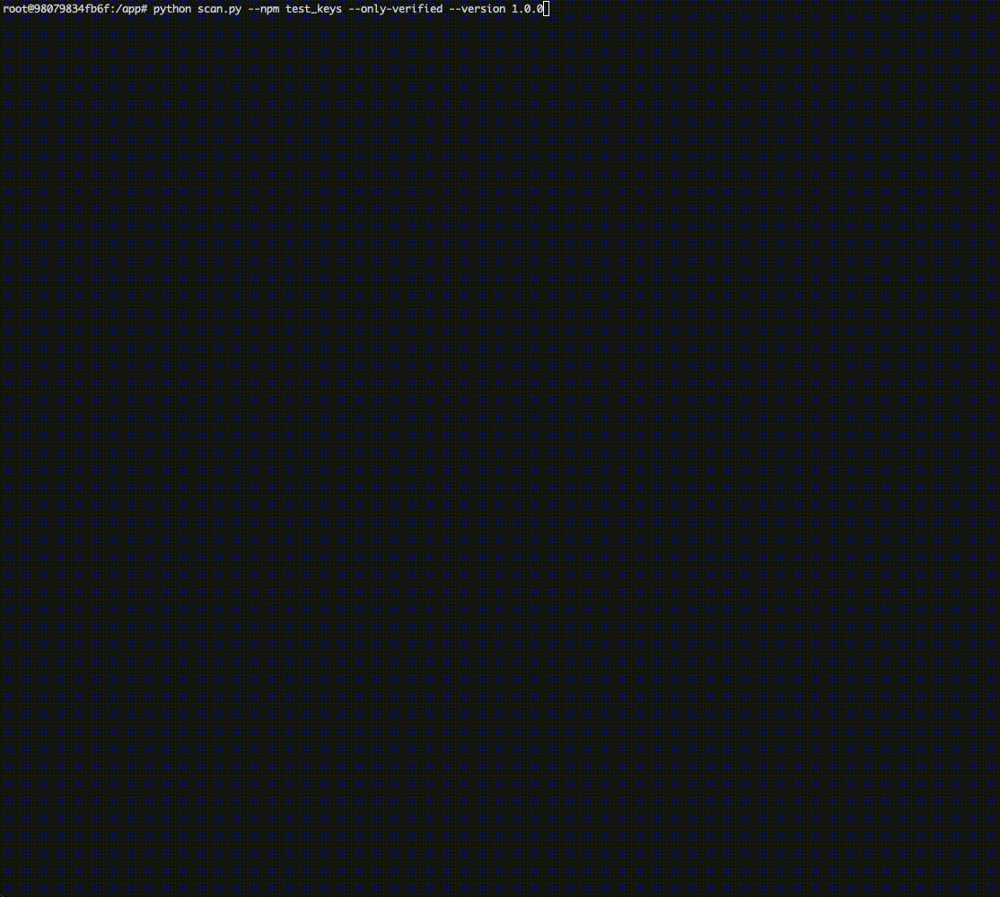

# REVELIO - Package Security Scanner

**Package Security Scanner - Scan packages for secrets using TruffleHog**

A powerful containerized tool that automatically downloads, extracts, and scans packages from PyPI and npm for embedded secrets, API keys, tokens, and other sensitive information using TruffleHog.



## Quick Start

### Build the Container

```bash
# Clone the repository
git clone <your-repo-url>
cd revelio-scan

# Build the Docker image
docker build -t revelio-scan .

# Run with an interactive shell for debugging
docker run -it revelio-scan

# Or run a direct scan
docker run revelio-scan python scan.py --npm lodash
```

## Usage

### Basic Commands

```bash
# Scan latest version of an npm package
python scan.py --npm @babel/core

# Scan specific version of a PyPI package  
python scan.py --pypi requests --version 2.28.1

# Scan all versions of a package (use with caution!)
python scan.py --npm lodash --all-versions
```

### TruffleHog Verification Options

```bash
# Only report verified secrets (fewer false positives)
python scan.py --npm lodash --only-verified

# Skip verification entirely (faster but more false positives)
python scan.py --pypi requests --no-verification

# Default behavior (standard verification)
python scan.py --npm @babel/core
```

### Advanced Examples

```bash
# Scan specific version with only verified results
python scan.py --pypi requests --version 2.28.1 --only-verified

# Fast scan of all versions without verification
python scan.py --npm express --all-versions --no-verification

# Scan scoped npm packages
python scan.py --npm @types/node --version 18.15.0
```

## Command Reference

### Package Ecosystems
- `--pypi`: Scan Python packages from PyPI
- `--npm`: Scan JavaScript packages from npm (supports scoped packages like `@scope/name`)

### Version Options
- `--version VERS`: Scan a specific version
- `--all-versions`: Scan all available versions **Use with caution for packages with many versions**
- *No flag*: Scan the latest version (default)

### TruffleHog Options
- `--only-verified`: Only report secrets that have been verified by TruffleHog
- `--no-verification`: Skip verification entirely (faster execution, more false positives)
- *No flag*: Use TruffleHog's default verification behavior

### Help
```bash
python scan.py --help
```

## Architecture

Revelio works by:

1. **Fetching** package metadata from the respective registry (PyPI/NPM)
2. **Downloading** source distributions or tarballs to `/tmp`
3. **Extracting** archives to temporary directories
4. **Scanning** extracted code with TruffleHog
5. **Reporting** any discovered secrets
6. **Cleaning** up all temporary files automatically

**Disclaimer**: This tool is for security research and authorized testing only. Always ensure you have permission to scan packages and respect the terms of service of package registries.